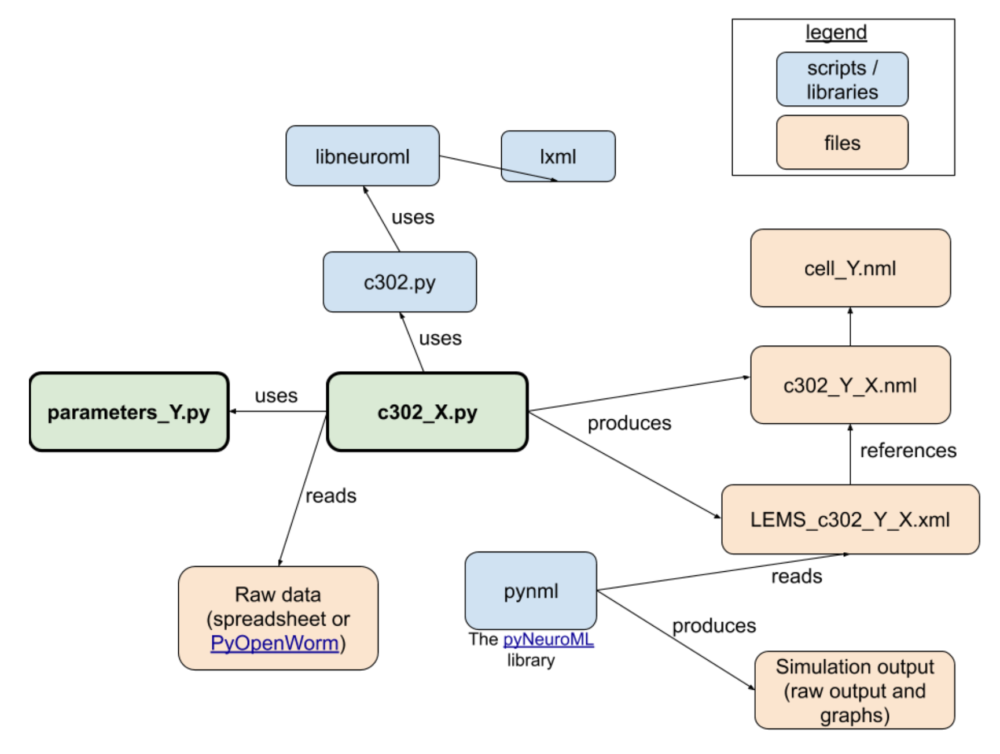

# Tools for the use of OpenWorm

The repository has been developed as part of my Bachelor Thesis Project:

UC3M | Bachelor Thesis Project
:---:|:---:
 | **MODELS OF NEUROMORPHIC COMPUTING: <br> Brain-body-environment simulation of *Caenorhabditis elegans* forward and backward locomotion**

In this repository you will find:
* Shell scripts developed for using the OpenWorm framework under a docker container.
* Jupyter Notebooks in Python 3 for interpreting the data. 
* Files for the forward and backward locomotion model in *Caenorhabditis elegans*. 

---

Results of the forward and backward locomotion model: 


---

# INTRODUCTION

## About OpenWorm 

[OpenWorm](http://www.openworm.org) aims to build the first comprehensive computational model of *Caenorhabditis elegans*: a microscopic roundworm nematode. Their approach towards building the nematode is to collect all the data from biological experiments and integrate it using software models. It has been divided into smaller software sub-projects that can be interconnected to provide various utilities inside the framework. For this project, I have made use of the c302 and Sibernetic frameworks. 


## About Docker Containers

A [Docker container](https://www.docker.com/get-started) is an isolated working place in which specific images can be run like the OpenWorm simulations. They allow to store code and all its dependencies so that applications are executed in a fast and secure way within different computers and operative systems. These containers can be executed from your terminal after installing Docker, and can run graphical user interface applications if executed with the proper display commands. The OpenWorm docker image contains all the necessary tools to make the simulation of the nematode C. Elegans using c302, pyNeuroML, NEURON, pyOpenWorm and Sibernetic (For more information, see the [OpenWorm repository](http://www.openworm.org))


---
# Quick Start: Using OpenWorm

### Install Docker

If you are a ubuntu user, you only need to run the following commands within your terminal:

    git clone https://github.com/ManuelCarrascoY/openworm_tools.git
    cd openworm_tools/
    ./install_docker.sh

This will install docker and login into you docker account. For Mac or Window users, make sure to follow the instructuions to install docker in your system found in the [Docker website](https://www.docker.com/get-started).

### Use the Docker Container

A container can be built with the shell script `build_container.sh`

    ./build_container.sh -n ContainerName #Set a name for the container

If no name tag is added, the default name will be set to `'worm'`. 
(Also note that the first time you run this command, Docker will install the *openworm/latest* docker image and it may take a few minutes). 

Once the container is built, you can check its status with the following command: 

    docker ps -a 

Okay, now we have the container created, we can attach to it using: 

    ./attach_to_container.sh -n ContainerName

Once within, run an `ls` command and make sure you can find the PyOpenWorn, c302, neuron, sibernetic, pyNeuroML, master_openworm.py and shared directories.
To close the container type ´exit´, to escape the container use: *Ctrl+P* and *Ctrl+Q*. 

Also check that GUI applications are running

    xlogo #This should pop a window with a big 'X'

Once the Container is build, if you want to close and erase it (note this will delete any work done inside that container):

    ./remove_container.sh -n ContainerName


**Mac Users**: 

In order to open GUI applications fron the docker container, follow these steps (you will need homebrew installed)
1. Install XQuartz
```
brew cask install XQuartz
```
2. Install Socat
```
brew install socat
```
3. Run socat (Check this [tutorial](https://www.youtube.com/watch?v=PKyj8sbZNYw))
```
socat TCP-LISTEN:6000,reuseaddr,fork UNIX-CLIENT:\"$DISPLAY\" &
```
4. Run the `build_container_OSX.sh` instead.

5. Chech that GUI applications are running by attaching to the container with `./attach_to_container`, and running inside the bash a simple logo: 
```
xlogo #This should pop a window with a big 'X'
```
---

# c302: Neuron and Muscle Simulation

To make a simulation using c302, I recommend following the instructions from the [c302 GitHub](https://github.com/openworm/c302).

You can run these instructions by attaching to the Docker container with `./attach_to_container`. Here is a file and package overview: 



On the `c302/` directory, you can find tools to make a fast use of c302 from a jupyter notebook and plot the obtained data using MatPlotLib


#### Run a c302 simulation
1. Go to `c302/` 
2. Check out the Python 2 commented script `c302/c302_tutorial.py`
3. Build your own Python 2 model!
4. Check the Python 3 jupyter notebook `c302/c302.ipynb` to run the simulation and plot the data. 

Example of neuronal dynamics plots: 


# Sibernetic: Body and Environment Simulation 

The Sibernetic physics simulator is designed to test the movement of our models. You will need a model which produces motion for **all of the muscles** of the nematode. 

For the simulations seen in `videos/`, the `c302/c302_FW_with_muscles.py` and the `c302/c302_BW_with_muscles.py` scripts were used. The forward and backward simulation could be achieved using the `c302/c302_FWandBW_with_muscles.py`. 

Video of the Forward locomotion | Video of the Backward locomotion
:---: | :---: 
 | 

#### Run the Sibernetic simulation
We will use the `master_openworm.py` inside the container. 

1. Go to `shared/modified_master_openworm.py` and change the reference to the name of your model.
```python
#Default is 15 ms of simulation time.
sim_duration = 15.0 # We will also change later the duration, this is only 15ms
if 'DURATION' in os.environ:
    sim_duration = float(os.environ['DURATION'])

DEFAULTS = {'duration': sim_duration,
            'dt': 0.005,
            'dtNrn': 0.05,
            'logstep': 100,
            'reference': 'FW', # Change this reference to the reference of your model
            'c302params': 'C2',
            'verbose': False,
            'device': 'GPU',
```
2. Run in terminal: 
```
docker exec worm cp ./shared/modified_master_openworm.py ./master_openworm.py
docker exec worm python master_openworm.py
```
3. Check the `./shared/output/` folder for the results of the simulation. 
    
4. This simulation should take no longer than 15 minutes. Check that it finishes and run a simulation changing `sim_duration = 15000.0` (1.5 seconds). It should take about 5 hours. 

